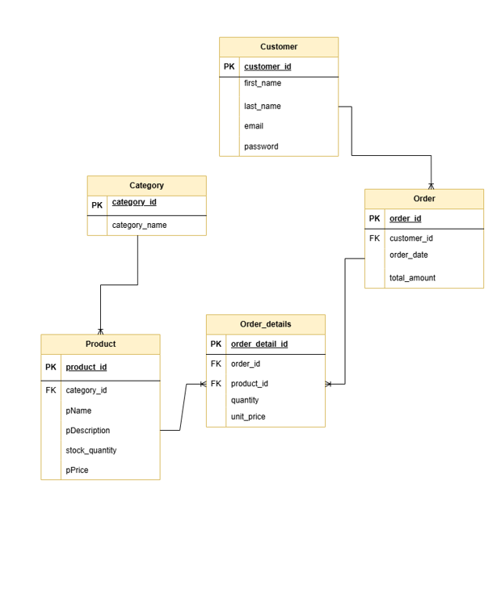

## E-Commerce Database Design Project

## 1. Project Description

This project represents a simplified E-Commerce Database System designed to manage customers, products, orders, and order details.
It demonstrates key database design concepts such as entity modeling, relationships, normalization, ERD creation, and SQL query development.

## 2. Table of Contents

- [Relationships Between Entities](#relationships-between-entities)
- [ERD Diagram](#erd-diagram)
- [Database Schema Scripts](#database-schema-scripts)
- [Inserted Data](#inserted-data)
- [SQL Queries](#sql-queries)

## 3. Relationships Between Entities 
-Customer (1) ─────── (M) Order
One customer can place many orders.

-Order (1) ─────── (M) Order_Details
One order can contain multiple order items.

-Product (1) ─────── (M) Order_Details
One product can appear in many order details.

-Order (M) ─────── (M) Product
Many-to-Many (resolved via Order_Details table)

## 4. ERD Diagram


## 5. Schema Scripts
```sql
use [E-Commerce_DB_Design]

CREATE TABLE Category (
    category_id INT PRIMARY KEY,
    category_name VARCHAR(50) NOT NULL
);

CREATE TABLE Product (
    product_id INT PRIMARY KEY,
    category_id INT,
    name VARCHAR(100),
    description VARCHAR(255),
    price DECIMAL(10,2),
    stock_quantity INT,

    FOREIGN KEY (category_id) REFERENCES Category(category_id)
);

CREATE TABLE Customer (
    customer_id INT PRIMARY KEY,
    first_name VARCHAR(50),
    last_name VARCHAR(50),
    email VARCHAR(100),
    password VARCHAR(100)
);

CREATE TABLE [Order] (
    order_id INT PRIMARY KEY,
    customer_id INT,
    order_date DATE,
    total_amount DECIMAL(10,2),

    FOREIGN KEY (customer_id) REFERENCES Customer(customer_id)
);

CREATE TABLE Order_Details (
    order_detail_id INT PRIMARY KEY,
    order_id INT,
    product_id INT,
    quantity INT,
    unit_price DECIMAL(10,2),

    FOREIGN KEY (order_id) REFERENCES [Order](order_id),
    FOREIGN KEY (product_id) REFERENCES Product(product_id)
);
```

## 6. Inserted Data
```sql
use [E-Commerce_DB_Design]

insert into Category  values
(1, 'Electronics'),
(2, 'Books'),
(3, 'Furniture');
 
INSERT INTO Product VALUES
(1, 1, 'Laptop', 'Gaming laptop', 1000, 10),
(2, 1, 'Phone', 'Smartphone', 600, 20),
(3, 2, 'Book SQL', 'Database book', 50, 100);

INSERT INTO Customer VALUES
(1, 'Ola', 'Youssef', 'ola@gmail.com', '123'),
(2, 'Rana', 'Ali', 'rana@gmail.com', '456');

INSERT INTO [Order] VALUES
(1, 1, '2026-04-01', 1600),
(2, 1, '2026-04-10', 50),
(3, 2, '2026-04-15', 600);

INSERT INTO Order_Details VALUES
(1, 1, 1, 1, 1000),
(2, 1, 2, 1, 600),
(3, 2, 3, 1, 50),
(4, 3, 2, 1, 600);
```

## 7. SQL Queries
```sql
--Write an SQL query to generate a daily report of the total revenue for a specific date.

SELECT order_date, SUM(total_amount)
FROM [Order]
WHERE order_date = '2026-04-01'
GROUP BY order_date;


--Write an SQL query to generate a monthly report of the top-selling products in a given month.

SELECT product.name, SUM(order_details.quantity) AS total_units_sold
FROM order_details
JOIN product ON order_details.product_id = product.product_id
JOIN [Order] ON order_details.order_id = [Order].order_id
WHERE [Order].order_date >= '2026-04-01'
  AND [Order].order_date < '2026-05-01'
GROUP BY product.name
ORDER BY total_units_sold DESC;

/* Write a SQL query to retrieve a list of customers who have placed orders totaling
more than $500 in the past month.Include customer names and their total order amounts.*/

SELECT 
    c.customer_id,
    c.first_name,
    c.last_name,
    SUM(o.total_amount) AS total_spent
FROM Customer c
JOIN [Order] o 
    ON c.customer_id = o.customer_id
WHERE 
    o.order_date >= DATEADD(MONTH, -1, GETDATE())
GROUP BY 
    c.customer_id,
    c.first_name,
    c.last_name
HAVING 
    SUM(o.total_amount) > 500;

